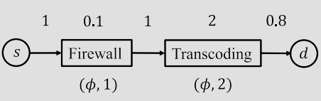

---
author:
- 戚一嘉豪 2200012732
bibliography:
- references.bib
date: 2024-10-04
title: "**应用物理实践探究1**"
---

# Preface

A new generation of services we call as augmented information services
arises, which can provide users with low-latency real-time processing of
data [@Weldon2015]. In contrast with the traditional information
services, augmented information services need to maintain large
distributed computing networks [@Weldon2015] to satisfy different
low-latency computation tasks rather than simply fetching data from
computing center, which inevitably suffers from long-time delay. As a
consequence, it's important for service providers to assign some
computation on these distributed computing nodes in a network and
address the routing as well as computing nodes' distribution problem.
Operators need to think of a method to dynamically change the
configuration and routing of network basing on different tasks' need,
load and function.

Dynamic control policies for configuration was initiated [@Feng2016]but
was limited to unicast traffic. So in this paper, the author proposes a
design for throughput-optimal dynamic packet processing and routing
polices for mixed-cast(unicast and multicast) service chain in
distributed computing networks. And the author characterize a conception
called the capacity region, under which arbitrary service can flow
through smoothly. Moreover, the author proposes Universal Computing
Network Control(UCNC)[@Zhang2021Optimal], the core strategy in this
paper, which determines the configuration of network under different
tasks.

# Background and notation

## Computing Network Model

1.  vanilla graph G = ($\nu$,$\epsilon$) with n = \|$\nu$\| nodes and m
    = \|$\epsilon$\| liniks.

2.  $\mu_u$: the processing capacity of a node; $\mu_{uv}$: the
    transmission capacity of link(u, v)

## Service Model

1.  a service $\phi \in \Phi$ has $M_\phi$ functions ($\phi$, i),
    $i \in (1, ..., M_\phi)$

2.  each function ($\phi$, i) has its computation requirement
    $r^{(\phi, i)}$ and flow scaling factor $\epsilon{(\phi, i)}$

3.  subset of computation nodes $N_{(\phi, i)} \subset \nu$

4.  A flow that requires service $\phi$ must be processed by the
    functions ($\phi$, i), $i \in {(1, . . . , M_\phi)}$ in order.

{width="50%"}

## Traffic Model

1.  commodity-(c, $\phi$) has source node $s_c$, destination nodes $D_c$
    and service$\phi$

2.  $A^{(c, \phi)}(t)$the number of exogenous arrivals of
    commodity-$(c, \phi)$ packets at node $s_c$ during time slot t and
    $\lambda^{(c, \phi)}$ the average arrival rate.

## Layered Graph

Let $G^{(\phi)} = (G^{(\phi,0)}, \ldots, G^{(\phi,M_{\phi})})$, with
edge set $\epsilon^{(\phi)}$ and vertex set $\nu^{(\phi)}$, denote the
layered graph associated with service chain $\phi$. Each layer
$G^{(\phi,i)}$ is an exact copy of the original graph $G$, used to
represent the routing of packets at stage $i$ of service $\phi$, i.e.,
the routing of packets that have been processed by the first $i$
functions of service $\phi$. Let $u^{(\phi,i)}$ denote the copy of node
$u$ in $G(\phi,i)$, and edge $(u^{(\phi,i)}, v^{(\phi,i)})$ the copy of
link $(u,v)$ in $G^{(\phi)}$. Across adjacent layers, a directed edge
from $u^{(\phi,i-1)}$ to $u^{(\phi,i)}$ for all $u \in N_{(\phi,i)}$ is
used to represent the computation requirement of function $(\phi,i)$.

{width="50%"}

## Proposition and Definition

**Proposition 1:**There is a one-to-one mapping between a flow from
$s^{\phi,0}$ to $D^{\phi,M_{\phi}}$ in $G^{(\phi)}$ and a flow from $s$
to $D$ processed by $\phi$ in $G$.

**Lemma 1:** Any arrival rate λ in the capacity region can be supported
by a policy that only uses efficient routes.

**Definition 1:** A commodity-$(c, \phi)$ unicast packet is routed over
a service chain path $T^{c,\phi}$ if

1.  $T^{c,\phi}$ is a path from $s^{c,\phi,0}$ to $d_c^{\phi,M_{\phi}}$
    in $G^{(\phi)}$.

2.  $w^{\phi,i}$ packets are routed over a link in $T^{c,\phi}$ that
    belongs to $G^{(\phi,i)}$.

3.  $x^{\phi,i}$ packets are routed over a link in $T^{c,\phi}$ that
    connects $G^{(\phi,i-1)}$ and $G^{(\phi,i)}$.

**Definition 2:** A commodity-$(c, \phi)$ multicast packet is routed
over a service chain Steiner tree[@hwang1992steiner] $T^{(c,\phi)}$ if

1.  $T^{(c,\phi)}$ is a Steiner tree (arborescence) that is rooted at
    $s^{(c,\phi,0)}$ and connected to $D_c^{(\phi,M^{\phi})}$ in
    $G^{(\phi)}$.

2.  $w^{(\phi,i)}$ packets are routed over a link in $T^{(c,\phi)}$ that
    belongs to $G^{(\phi,i)}$.

3.  $x^{(\phi,i)}$ packets are routed over a link in $T^{(c,\phi)}$ that
    connects $G^{(\phi,i-1)}$ and $G^{(\phi,i)}$.

# Contribution1: CAPACITY REGION

The concept of a capacity region addresses the challenge of processing
both unicast and multicast packets through a specified sequence of
service functions. The central idea is a set delineating the array of
supportable arrival rates within the network's infrastructure without
over-saturating both computational and communicative resources.

The author argues that for any service chain, there exist policies which
support rates within this capacity region using efficient routes
exclusively. Thus, a packet's route through the network is both minimal
and absent of cycles, further proven by Theorem 1, ensuring the capacity
region isn't compromised by these routing restrictions. It defines the
network's limits using equations that take into account the packet
flows, service stages, computing nodes' capacity, and it incorporates
flow rates, scaling factor, computing workload, and network link
capacities.

The communication and computation capacity constraints are represented
as follows.

$\sum_{(k,i,c,\phi) \in S_{uv}} w^{(\phi,i)} \lambda^{(c,\phi)}_k \leq \mu_{uv}, \quad \forall (u,v) \in \mathcal{E},$

$\sum_{(k,i,c,\phi) \in S_u} x^{(\phi,i)} \lambda^{(c,\phi)}_k \leq \mu_u, \quad \forall u \in \mathcal{V}.$

# Contribution2: DYNAMIC ROUTING IN A VIRTUAL SYSTEM

The paper details the creation of a virtual queue system and dynamic
routing strategy to optimize the control of distributed computing
networks dealing with mixed-cast (unicast and multicast) traffic flows.
The virtual queue system represents a simplified model of the physical
network where packets are simultaneously queued for all links in their
minimum path upon entry into the network. This virtual model allows the
examination of traffic through the network without the need to track the
sequential progress of packets through each link, streamlining the study
of network dynamics and control policies.

The dynamic routing strategy depends on the virtual queue model, guiding
packet routing to ensure that average packet arrival rates do not exceed
service rates at any given virtual link. Such a strategy works with the
Extended Nearest-to-Origin (ENTO) scheduling policy[@Sinha2018b]. The
ENTO policy prioritizes packets based on their proximity to the source
node, ensuring that those closer to the source are processed first,
which prevents bottlenecks caused by longer queued packets and
contributes to maintaining stability in the physical queues.

By applying the routing policy from the virtual system to the physical
network, the paper asserts that the physical queue stability can be
achieved. The theorem further underlines that strong stability of the
virtual queues, where the time-averaged queue length remains finite,
ensures that the physical queues can handle the traffic rates up to the
network's capacity. In essence, if the virtual system can sustain the
load, the physical system can too.This dual framework helps to avoid
routing packets through overburdened links and nodes in the network,
thus avoiding congestion.

By adopting such strategies, the network can maximize its throughput,
ensuring efficient and reliable service map without unbearable
congestion and delay. The presented model and strategies provide a
foundation for further modifying and improving complex computing
networks where traffic demands are diverse and dynamically changing.

# Conclusion for paper-reading

The author proposes a new method called Universal Computing Network
Control(UCNC) to address the routing and maintaining problem of
throughput-optimal policy for mixed-cast traffic in a distributed
computing system with constrained computing resources. Since the author
has shown detailed proof for the algorithm's stability and no extant
problems or any further scheduled improvements, I think the major
problem may be the practical appliance of this algorithm on devices with
limited computing resources. And it's also worthwhile to think of a
concrete algorithm for multicast problems.

# Experiment Goal

The main goal of my simulation work concentrates on realizing the final
results of what's been achieved in this paper[@Zhang2021Optimal]. And if
there's some time left after realizing it, I may try to find if there's
any methods to optimize this algorithm UCNC a little bit and try to find
some practical solutions for obtaining minimum Steiner Tree.

# Experiment Methodology

Source code with comprehensive notation can be found in Appendix.

## Input Generation

For the first line, I generate num_commodity, that means how many
different kind of commodities that may come into this network. Next we
will get ten sets of inputs, the first line of each set of inputs
represents the commodity's id. The first number in the second line
represents its source node, and the following numbers represent its
destination node (there may be more than one). The last line is its
service chain, in groups of two digits. The first number in each group
is r(output rate), and the second number is $\epsilon$(scaling factor).

For the remaining part, we track packets arriving from time 0 up to
max_time. At each time point t, we identify the commodity by its id and
count the number of packets for it that arrive at that particular time.

## UCNC Realization

{width="50%"}

1.  First, we build a vanilla graph according to this image, with edge
    weight equal to computing ability and computing nodes equal to 3 and
    8 using extant python lib------networkx.

2.  At each time slot t, we save those arriving commodities into
    Time\[t\] and for each specific commodity, we build a corresponding
    layer graph basing on vanilla graph, assigning the cost of link
    $(u^{\phi, i}, v^{\phi, i})$ to be $w^{\phi, i}Q_{uv}(t)$ and cost
    of link $(u^{\phi, i-1}, v^{\phi, i})$ be $x^{\phi, i}Q_u(t)$. In
    more detail, we copy vanilla graph for $len(service\_chain)$ times
    and connect computing nodes in each layer with an additional link.
    So if we move a packet from (souce, layer=1) to (dest,
    layer=len(service_chain)), its transmission service together with
    processing service is done.

3.  And then we search for a minimum-cost path(using built-in algorithm
    nx.shortest_path or nx.steiner_tree) from its source to its
    destination(s), which this packet will follow for its whole
    transmission and processing.

4.  At each physical link and computing node, we update its actual queue
    under policy ENTO. We use built-in priority_queue lib to maintain a
    priority queue for each physical link and computing node to make
    packets closer to the source be processed first.

5.  At last, we update virtual queue length by the following equations.

$$\widetilde{Q}_{uv}(t + 1) = \left( \widetilde{Q}_{uv}(t) + \sum_{(c,\phi) \in (C,\Phi)} A^{(c,\phi)}_{uv} \pi^*_{(t)} - \mu_{uv} \right)^{+};$$

$$\widetilde{Q}_{u}(t + 1) = \left( \widetilde{Q}_{u}(t) + \sum_{(c,\phi) \in (C,\Phi)} A^{(c,\phi)}_{u} \pi^*_{(t)} - \mu_{u} \right)^{+}.$$

where $\widetilde{Q}_{uv}$ stands for virtual queue length of link uv,
${A_{uv}}^{(c, \phi)} \pi^{*}(t)$ stands for actual queue length of link
uv under routing policy$\pi^{*}$ and $\mu_{uv}$ stands for transmission
ability of link uv.

## Upper Level Code

Since in Input Generation part we have randomly generated packets
arriving at time t, the capacity region for this fixed input is
determined to be unique. What we need is to recall previous code UCNC
and increase computing and transmission ability from start_ability to
end_ability to figure out the boundary of this unique capacity region.

## Tried: Changing edges' weight in virtual routing

In the model proposed by Zhang et al. (2021)[@Zhang2021Optimal], the
value assigned to network edges represents the quantification of
congestion condition. This value is constrained to be non-negative,
reflecting the practical impossibility of a physically negative queue
length. We can understand if an edge possesses a high computing
capacity, it should process a greater number of packets to alleviate the
burden on less capable nodes or edges. Consequently, I removed the
absolute value function from the calculation of edge values. However,
this modification introduces a challenge: the potential for negative
weight cycles in scenarios of low network utilization. To solve this, we
can impose the constraint that each packet traverses every node and edge
only once but then it transforms the problem into an NP-hard one. And
when the network is highly congested, value of edges can't be negative.
Therefore, this seemingly simple idea may not yield the anticipated
network improvements.

## Tried: Practical algorithm for finding minimum steiner tree

Finding the optimum minimum steiner tree is proven to be NP-hard and in
my simulation, I implement an approximate algorithm to realize minimum
steiner tree by Lawrence Kou et al (1981)[@kou1981fast], which is to
combine a minimum path to any destination with all other destinations in
the last layer in multi-casting task. Further work should focus more on
applying a concrete and efficient approximate algorithm to ease
network's congestion. Moreover, I attempted to implement a maximum
flowing algorithm instead of simple minimum path algorithm, which might
help transform this NP-hard problem into a soluble one but I haven't
finished it yet before deadline.

# Experiment Results

## Experiment Result1: reaching for the capacity region

{width="50%"}

As is defined in this paper, capacity region stands for the max
processing ability of this service map, beyond which there might be
ostensible congestion phenomenon shown in the image above. So it means
we keep the computing and transferring ability of this map unchanged,
while at the same time, we increase the average arriving rate. As a
result, we should see the average delay of each arrived packet should
stay steady for some time and if the average arriving rate touch the
capacity region, it should skyrocketing exponentially. To avoid simply
following the author's footsteps, I try to demonstrate this phenomenon
from the other side. I fix the average arriving rate $lambda$ unchanged
and then change the computing ability of nodes and transferring ability
of edges in the map. We should expect something contrary. That's the
average arriving rate exponentially decreases when computing ability
rises.

{width="70%"}

We might figure out the capacity region for this arriving rate lies
somewhere around 25.

And if we reduce the arriving rate from $\lambda = 10$(a relatively
heavy load) to $\lambda=2$(a very light load), we can see this will
change a little bit.

{width="70%"}

I think it can be explained by the load is too light for this service
map, and if we enhance the processing ability a little bit, average
delay will change hugely. So this curve isn't so smooth like before. And
to prove this supposition, I try to give this service map a really heavy
load($\lambda=20$), we can finally receive a smooth curve as expected.

{width="70%"}

## Experiment Result2: average delay time against time

To test the stability of this network, we should observe the average
delay for each arrived packet against time and it should be a constant
within capacity region. And it should increase with time if arriving
rate go beyond capacity region.

{width="75%"}

As expected, we see average delay increases with time, which indicates
so many packets get congested before sent out. And if we enhance
computing ability, we should expect for it being nearly a constant.

<figure>
<p> </p>
<figcaption>computing ability=29 and 40, average delay against
time</figcaption>
</figure>

We can figure out when we set computing ability to 29, the average delay
is nearly stable with time increasing. And if we further enhance
computing ability to 40, we can see the peak of this curve is somewhat
lower than computing ability is 29 and the network performances better
than the previous one. And here's something in the middle to show this
transiting process from fierce oscillating to almost steady.

<figure>
<p>  </p>
<p>  </p>
<figcaption>computing ability=23, 25, 27, average delay against
time</figcaption>
</figure>

## Experiment Result3: edges' and nodes' congestion

We should observe the queue length of each node and each edge to see if
it remains in a scope as time increases within the capacity region.

<figure>
<p> </p>
<figcaption>Within capacity region, queue length against
time</figcaption>
</figure>

And queue length should rises if the arriving rate surpasses capacity
region to denote its congestion.

{width="50%"}

# Conclusion and future experiments

During this period of research, I finish realizing the work Zhang et al.
(2021)[@Zhang2021Optimal] and draw some images of congestion, queue
length and average delay to show this model's robustness. Moreover, I
attempted to implement something innovative, i.e.------to assign a
negative number to the edge weight of the virtual queue(failed). At
last, I think carrying out a practical steiner tree algorithm might be
promising for further enhancing processing ability of this model.

# Input Generation

``` {.python language="Python"}
def generate_random_commodities():
    commodities = []
    for id_commodity in range(num_commodities):
        #The number of packets for this commodity should be average arriving time multiply max arriving time
        num_packets = max_time * lamb[id_commodity]
        
        
        # Randomly choose the number of service functions for this commodity
        num_services = random.randint(1, max_services)
        
        #generate source and destination, with 50% unicast and 50% multicast for mixed casting problem
        if random.random() < 0.5:
            num_dest = 1
        else:
            num_dest = random.randint(2, 4)
        dest = random.sample(range(1, 12), num_dest)
        dest.sort()
        sour = random.randint(1, 11)
        
        
        # Generate the service function chain for this commodity
        service_chain = []
        for _ in range(num_services):
            r = round(random.uniform(0.01, 2), 2) #r stands for scaling factor, which means r units of computation resources are needed for processing this commodity at this stage
            epsilon = round(random.uniform(1, 2), 2) #epsilon stands for what the output of this service function will be epsilon times input flow rate
            service_chain.append((r, epsilon))
            
        
        # Append the commodity to the list
        commodity = {
            'num_packets': num_packets,
            'service_chain': service_chain,
            'sour': sour,
            "dest": dest
        }
        commodities.append(commodity)
    return commodities
```

``` {.python language="Python"}
num_commodities = 10  # Number of commodities
    lamb = [[] for _ in range(num_commodities)] #average arriving rate for this commodity
    for i in range(num_commodities):
        lamb[i] = random.randint(10, 10)
    max_time = 999    # Maximum arriving time
    max_services = 5     # Maximum number of service functions in a chain of this commodity
```

        # Generate random commodities
        random_commodities = generate_random_commodities()
        
        # Printing the generated commodities
        print(num_commodities)
        for id_commodity in range(num_commodities):
        print(id_commodity)
        print(random_commodities[id_commodity]['sour'], *random_commodities[id_commodity]['dest'])
        for i in range(len(random_commodities[id_commodity]['service_chain'])):
            print(*random_commodities[id_commodity]['service_chain'][i], end=' ')
        print()
        
        print()
        
        # Generate input for each commodity
        for t in range(max_time):
        print(t)
        for id_commodity in range(num_commodities):
            num = random.randint(0, 2 * lamb[i])
            if num == 0:
                continue
            #random_commodities[id_commodity]['num_packets'] = random_commodities[id_commodity]['num_packets'] - num
            print(id_commodity, num)
        print()

# UCNC Realization

        # Initialize a Graph object
        G = nx.Graph()
        
        # Add the edges to the graph (assumed undirected)
        edges_with_weights = [(1, 2, transmission_ability), 
                            (1, 3, transmission_ability), 
                            (2, 3, transmission_ability), 
                            (2, 4, transmission_ability), 
                            (3, 6, transmission_ability), 
                            (4, 5, transmission_ability), 
                            (5, 6, transmission_ability), 
                            (5, 7, transmission_ability), 
                            (6, 8, transmission_ability), 
                            (7, 8, transmission_ability), 
                            (7, 10, transmission_ability), 
                            (8, 9, transmission_ability), 
                            (9, 11, transmission_ability), 
                            (10, 11, transmission_ability)]
        G.add_weighted_edges_from(edges_with_weights)

        #define the id of nodes with computation ability
        nodes_with_computation_ability = [
            3, 8
        ]
        for node in nodes_with_computation_ability:
            G.nodes[node]["computation_ability"] = computation_ability

        #initialization for lists and arrays that will be used in the following
        num_nodes = 13
        
        #virtual queue
        Q_uv = [[0 for _ in range(num_nodes)] for _ in range(num_nodes)]
        Q_u = [0 for _ in range(num_nodes)]
        precision = 1
        
        #actual queue
        AQ_uv = [[PriorityQueue() for _ in range(num_nodes)] for _ in range(num_nodes)]
        AQ_u = [PriorityQueue() for _ in range(num_nodes)]
        #AQ_uv_for_image/AQ_u_for_image has an additional dimension for time t to plot the relationship between acutal queue length and time t 
        AQ_uv_for_image = [[[] for _ in range(num_nodes)] for _ in range(num_nodes)]
        AQ_u_for_image = [[] for _ in range(num_nodes)]
        
        #path for each commodity, path[id_commodity][t] stands for the routing for commodity i that arrives at time t.
        path_for_commodity = [[[] for _ in range(max_time)] for _ in range(1000)]
        
        #average delay for all arrived packets, total_delay[computation_ability] means if the computation ability is computation_ability, then the overall delay for it will be total_delay[computation_ability]
        total_delay = [0 for _ in range(1000)]
        total_arrival = [0 for _ in range(1000)]
        #total_delay_for_image has an addtional dimension for time t to plot the relationship between total_delay versus time t to show its stability within capacity region
        total_delay_for_image = [[0 for _ in range(max_time)] for _ in range(1000)]
        total_arrival_for_image = [[0 for _ in range(max_time)] for _ in range(1000)]
        aver_delay_for_image = [[0 for _ in range(max_time)] for _ in range(1000)]

        #num_congested shows how many packets still get congested in the network when time t reaches max_time. The greater it is, the network is more congested and less stable.
        num_congested = [0 for _ in range(max_time)]
        total_packets = 0

        #main part
        for t in range(max_time):
            A_uv = [[0 for _ in range(num_nodes)] for _ in range(num_nodes)]
            A_u = [0 for _ in range(num_nodes)]
            
            for _ in range(precision):
                if Time[t] == []:
                    #for every t, if there's not any arriving packets, all we need is to update virtual queue and actual queue with ENTO.
                    for u, v, transmission_ability in G.edges(data='weight'):
                        Q_uv[u][v] = max(Q_uv[u][v] - transmission_ability, 0)
                    
                    for u in nodes_with_computation_ability:
                        Q_u[u] = max(Q_u[u] - G.nodes[u]["computation_ability"], 0)

                    #It's a must to define a temporary queue when moving packets from current edge to next edge. Otherwise, you will move the packet you have just moved in to its next dued edge, so you will move it more than once in a single unit time.
                    TAQ_uv = [[[] for _ in range(num_nodes)] for _ in range(num_nodes)]
                    TAQ_u = [[] for _ in range(num_nodes)]
                    for u, v, transmission_ability in G.edges(data="weight"):
                        for _ in range(transmission_ability):
                            if AQ_uv[u][v].empty():
                                break
                            top_element = AQ_uv[u][v].get()
                            
                            #top_element[0] stands for how many steps has a packet travelled since its origin.
                            top_element[0] += 1

                            #If it doesn't reach its destination, and the next step for it isn't to process it, then send it to next edge 
                            if (top_element[0]+1) < len(path_for_commodity[top_element[1]][top_element[3]]) and path_for_commodity[top_element[1]][top_element[3]][top_element[0]][0] != path_for_commodity[top_element[1]][top_element[3]][top_element[0]+1][0]:
                                nx_edge = [path_for_commodity[top_element[1]][top_element[3]][top_element[0]][0], path_for_commodity[top_element[1]][top_element[3]][top_element[0]+1][0]]
                                nx_edge.sort()
                                TAQ_uv[nx_edge[0]][nx_edge[1]].append(top_element)
                            #If it doesn't reach its destination, and the next step for it is to process it, then add it to the queue of a computing node
                            elif (top_element[0]+1) < len(path_for_commodity[top_element[1]][top_element[3]]) and path_for_commodity[top_element[1]][top_element[3]][top_element[0]][0] == path_for_commodity[top_element[1]][top_element[3]][top_element[0]+1][0]:
                                TAQ_u[path_for_commodity[top_element[1]][top_element[3]][top_element[0]][0]].append(top_element)
                            #It reaches its destination.
                            else:
                                total_delay[computation_ability] += (t + 1 - top_element[3])
                                total_arrival[computation_ability] += 1
                            
                            
                            
                    #The same measures of processing packets in a edge.
                    for u in nodes_with_computation_ability:
                        for _ in range(computation_ability):
                            if AQ_u[u].empty():
                                break
                            top_element = AQ_u[u].get()
                            top_element[0] = top_element[0] + 1
                            if (top_element[0]+1) < len(path_for_commodity[top_element[1]][top_element[3]]) and path_for_commodity[top_element[1]][top_element[3]][top_element[0]][0] != path_for_commodity[top_element[1]][top_element[3]][top_element[0]+1][0]:
                                nx_edge = [path_for_commodity[top_element[1]][top_element[3]][top_element[0]][0], path_for_commodity[top_element[1]][top_element[3]][top_element[0]+1][0]]
                                nx_edge.sort()
                                TAQ_uv[nx_edge[0]][nx_edge[1]].append(top_element)
                            elif (top_element[0]+1) < len(path_for_commodity[top_element[1]][top_element[3]]) and path_for_commodity[top_element[1]][top_element[3]][top_element[0]][0] == path_for_commodity[top_element[1]][top_element[3]][top_element[0]+1][0]:
                                TAQ_u[path_for_commodity[top_element[1]][top_element[3]][top_element[0]][0]].append(top_element)
                            else:
                                total_delay[computation_ability] += (t + 1 - top_element[3])
                                total_arrival[computation_ability] += 1
                            
                            
                            
                    #Put all packets in the temporary queue into actual queue.
                    for u, v, transmission_ability in G.edges(data="weight"):
                        for item in TAQ_uv[u][v]:
                            AQ_uv[u][v].put(item)
                    
                    for u in nodes_with_computation_ability:
                        for item in TAQ_u[u]:
                            AQ_u[u].put(item)
                    
                    #Save the data for plotting
                    for u, v, transmission_ability in G.edges(data="weight"):
                        AQ_uv_for_image[u][v].append(AQ_uv[u][v].qsize())
                    for u in nodes_with_computation_ability:
                        AQ_u_for_image[u].append(AQ_u[u].qsize())
                    
                    
                else:
                    #for time t, there arrives commodities saved in Time[t]
                    for id_commodity in Time[t]:
                        #construct layered graph for every single commodity that arrives at time t. Weight of edge is its quantization of congested condition.  
                        layered_G = nx.Graph()
                        
                        #function (phi, layer) requires x_layer units computation resourse
                        #function (phi, layer) outputs w_layer units packets
                        w_layer = 1
                        x_layer = 1
                        num_layer = len(service_chain[id_commodity])
                        for layer in range(num_layer):
                            x_layer = w_layer * service_chain[id_commodity][layer][0]
                            w_layer = w_layer * service_chain[id_commodity][layer][1]
                            for (u, v) in G.edges():
                                layered_G.add_edge((u, layer), (v, layer), weight=w_layer*Q_uv[u][v])
                            if layer:
                                for u in nodes_with_computation_ability:
                                    layered_G.add_edge((u, layer - 1), (u, layer), weight=x_layer*Q_u[u])

                        #find the shortest path
                        if (num_dest[id_commodity] == 1):
                            path = nx.shortest_path(layered_G, source=(sour[id_commodity], 0), target=(dest[id_commodity][0], num_layer-1),weight='weight')
                        else:
                            path = nx.shortest_path(layered_G, source=(sour[id_commodity], 0), target=(dest[id_commodity][0], num_layer-1),weight='weight')
                            
                            
                            # Create a subgraph for the last layer for multicast problem
                            lastlayer_formulticast = nx.Graph()
                            for (u, v, weight) in layered_G.edges(data='weight'):
                                if u[1] == num_layer-1 and v[1] == num_layer-1:
                                    lastlayer_formulticast.add_edge(u[0], v[0], weight=weight)
                            
                            path_connects_dest = steiner_tree(lastlayer_formulticast, dest[id_commodity], method="kou")
                            steiner_tree_nodes = [ (x, num_layer-1) for x in path_connects_dest.nodes() ]
                            path.extend(steiner_tree_nodes)
                        
                        
                        #save the minimum costing path for commodity "id_commodity" that arrives at time t
                        path_for_commodity[id_commodity][t] = path
                        
                        #add all packets of this commodity into actual queue
                        total_packets += num_packets[t][id_commodity]
                        if len(path_for_commodity[id_commodity][t]) > 1:
                            for id_packet in range(num_packets[t][id_commodity]):
                                if (path_for_commodity[id_commodity][t][0][0] != path_for_commodity[id_commodity][t][1][0]):
                                    edge = [path_for_commodity[id_commodity][t][0][0], path_for_commodity[id_commodity][t][1][0]]
                                    edge.sort()
                                    AQ_uv[edge[0]][edge[1]].put([0, id_commodity, id_packet, t])
                                else:
                                    AQ_u[path_for_commodity[id_commodity][t][0][0]].put([0, id_commodity, id_packet, t])
                        else:
                            total_arrival[computation_ability] += 1
                        
                        
                        #compute A_uv and A_u
                        x_layer = w_layer = 1
                        layer = 0
                        for i in range(len(path) - 1):
                            if (path[i+1][1] != layer):
                                layer = layer + 1
                                x_layer = w_layer * service_chain[id_commodity][layer][0]
                                w_layer = w_layer * service_chain[id_commodity][layer][1]
                            u = path[i][0]
                            v = path[i+1][0]
                            A_uv[u][v] = A_uv[u][v] + w_layer * num_packets[t][id_commodity]
                            A_u[u]= A_u[u] + x_layer * num_packets[t][id_commodity]

                    
                    #for every t, update virtual queue and actual queue with ENTO. The same with above.
                    for u, v, transmission_ability in G.edges(data="weight"):
                        Q_uv[u][v] = max(Q_uv[u][v] + A_uv[u][v] - transmission_ability, 0)
                    for u in nodes_with_computation_ability:
                        Q_u[u] = max(Q_u[u] + A_u[u] - G.nodes[u]["computation_ability"], 0)
                    
                    TAQ_uv = [[[] for _ in range(num_nodes)] for _ in range(num_nodes)]
                    TAQ_u = [[] for _ in range(num_nodes)]
                    for u, v, transmission_ability in G.edges(data="weight"):
                        for _ in range(transmission_ability):
                            if AQ_uv[u][v].empty():
                                break
                            top_element = AQ_uv[u][v].get()
                            top_element[0] += 1
                            if (top_element[0]+1) < len(path_for_commodity[top_element[1]][top_element[3]]) and path_for_commodity[top_element[1]][top_element[3]][top_element[0]][0] != path_for_commodity[top_element[1]][top_element[3]][top_element[0]+1][0]:
                                nx_edge = [path_for_commodity[top_element[1]][top_element[3]][top_element[0]][0], path_for_commodity[top_element[1]][top_element[3]][top_element[0]+1][0]]
                                nx_edge.sort()
                                TAQ_uv[nx_edge[0]][nx_edge[1]].append(top_element)
                            elif (top_element[0]+1) < len(path_for_commodity[top_element[1]][top_element[3]]) and path_for_commodity[top_element[1]][top_element[3]][top_element[0]][0] == path_for_commodity[top_element[1]][top_element[3]][top_element[0]+1][0]:
                                TAQ_u[path_for_commodity[top_element[1]][top_element[3]][top_element[0]][0]].append(top_element)
                            else:
                                total_delay[computation_ability] += (t + 1 - top_element[3])
                                total_arrival[computation_ability] += 1
                            
                            
                            
                    
                    for u in nodes_with_computation_ability:
                        for _ in range(computation_ability):
                            if AQ_u[u].empty():
                                break
                            top_element = AQ_u[u].get()
                            top_element[0] = top_element[0] + 1
                            if (top_element[0]+1) < len(path_for_commodity[top_element[1]][top_element[3]]) and path_for_commodity[top_element[1]][top_element[3]][top_element[0]][0] != path_for_commodity[top_element[1]][top_element[3]][top_element[0]+1][0]:
                                nx_edge = [path_for_commodity[top_element[1]][top_element[3]][top_element[0]][0], path_for_commodity[top_element[1]][top_element[3]][top_element[0]+1][0]]
                                nx_edge.sort()
                                TAQ_uv[nx_edge[0]][nx_edge[1]].append(top_element)
                            elif (top_element[0]+1) < len(path_for_commodity[top_element[1]][top_element[3]]) and path_for_commodity[top_element[1]][top_element[3]][top_element[0]][0] == path_for_commodity[top_element[1]][top_element[3]][top_element[0]+1][0]:
                                TAQ_u[path_for_commodity[top_element[1]][top_element[3]][top_element[0]][0]].append(top_element)
                            else:
                                total_delay[computation_ability] += (t + 1 - top_element[3])
                                total_arrival[computation_ability] += 1
                            
                            
                    
                    for u, v, transmission_ability in G.edges(data="weight"):
                        for item in TAQ_uv[u][v]:
                            AQ_uv[u][v].put(item)
                    
                    for u in nodes_with_computation_ability:
                        for item in TAQ_u[u]:
                            AQ_u[u].put(item)
                    
                    
                    
                    for u, v, transmission_ability in G.edges(data="weight"):
                        AQ_uv_for_image[u][v].append(AQ_uv[u][v].qsize())
                    for u in nodes_with_computation_ability:
                        AQ_u_for_image[u].append(AQ_u[u].qsize())
                    

            #compute number of packets that are stilled congested in the network after time t
            for u, v, transmission_ability in G.edges(data="weight"):
                num_congested[t] += AQ_uv[u][v].qsize()
            for u in nodes_with_computation_ability:
                num_congested[t] += AQ_u[u].qsize()
            total_arrival[computation_ability] = total_packets - num_congested[t]
            total_delay_for_image[computation_ability][t] = total_delay[computation_ability]
            total_arrival_for_image[computation_ability][t] = total_arrival[computation_ability]

        #there's punishment for congested packets, which may drive up total delay but we didn't take them into account, because we have only calculated total delay for packets that already arirved.
        total_delay[computation_ability] += 10 * max_time * num_congested[max_time-1]
        print(total_packets, num_congested[max_time-1], total_arrival[computation_ability])

# Upper Level Code

        start_computation_ability = 1
        end_computation_ability = 100
        total_packets = sum(element for sublist in num_packets for element in sublist)

        #find out its total delay for every single conputation ability from start_computation_ability to end_computation_ability. it should decrease.
        
        #def UCNC_with_computation_ability(computation_ability, transmission_ability, max_time, Time, num_packets, service_chain, sour, dest, num_dest):
        for computation_ability in range(start_computation_ability, end_computation_ability):
            total_delay[computation_ability], num_congested = UCNC_record1.UCNC_with_computation_ability(computation_ability, computation_ability, max_time, Time, num_packets, service_chain, sour, dest, num_dest)
            aver_delay[computation_ability] = (total_delay[computation_ability]) / (total_packets - num_congested + 0.01)
            print(computation_ability, aver_delay[computation_ability])

# What I have learned

1.  Unify coding style and avoid renaming variables to make codes
    accessible and readable afterwards.

2.  Remember to keep some redundancy(store intermediate variables),
    which is favorable for debugging and further work.

3.  An hour talking with others is more beneficial than one day's hard
    work.(I misunderstood some principal perceptions and ideas in this
    article, rendering an entire day's coding work useless.)

4.  Utilize extant lib as much as possible. Unnecessary to manufacture a
    tyre again.

5.  Don't be ashamed of any naive innovative ideas.
